# GenLayer Portal Animated Spinner

An animated loading spinner designed for the **GenLayer Portal**, incorporating the authentic vector identity of the GenLayer brand mark, brand primary **Kinetic Cobalt (`#110FFF`)**, and high-precision easing curves calibrated for decentralized machine speed.


---

## 💎 Features

- **Authentic GenLayer Brand Geometry**: Utilizes the exact vector polygon points of the official GenLayer mark.
- **Dual Background Support**: Optimized for both **Photon / Ceramic Node** (`#FFFFFF` / `#F5F5F5`) and **Carbon Void** (`#070707`).
- **Infinite Smooth Loop**: Calibrated at `1.1s` with cubic-bezier `(0.4, 0, 0.2, 1)` easing.
- **Pixel-Sharp at Any Size**: Tested and verified from `16px` (button spinners) to `128px` (full-page loaders).
- **Zero Dependencies**: Pure SVG SMIL and CSS-only implementations included.
- **Accessibility & Motion Preference**: Native `prefers-reduced-motion` compliance built in.

---

## 🎨 Brand Tokens Used

| Token | Hex | Role |
| :--- | :--- | :--- |
| **Kinetic Cobalt** | `#110FFF` | Primary orbital sweep & accent |
| **Carbon Void** | `#070707` | Dark mode background & light mark core |
| **Ceramic Node** | `#F5F5F5` | Neutral surface & container fill |
| **Photon** | `#FFFFFF` | Light mode surface & dark mode wings |
| **Success / Consensus** | `#00FF66` | Validator active states |

---

## 📦 Files in this Repository

- `index.html` — Interactive design showcase with background switcher, scale tests, and live Portal loading state mockups.
- `genlayer-spinner.svg` — Standalone production SVG spinner (Standard / Light backgrounds).
- `genlayer-spinner-dark.svg` — Standalone production SVG spinner (Dark / Carbon Void backgrounds).

---

## 🚀 Quick Start & Integration

### Option 1: Standard HTML / Image Tag

```html
<!-- Light Backgrounds -->


<!-- Dark Backgrounds (Carbon Void) -->

```

### Option 2: Inline SVG (Recommended for dynamic theming)

```xml
<svg xmlns="http://www.w3.org/2000/svg" viewBox="0 0 100 100" width="48" height="48" role="img" aria-label="Loading GenLayer">
  <defs>
    <linearGradient id="gl-orbit-grad" x1="0%" y1="0%" x2="100%" y2="100%">
      <stop offset="0%" stop-color="#110FFF" stop-opacity="1"/>
      <stop offset="60%" stop-color="#110FFF" stop-opacity="0.4"/>
      <stop offset="100%" stop-color="#110FFF" stop-opacity="0"/>
    </linearGradient>
  </defs>

  <style>
    @keyframes gl-spin-track {
      0%   { transform: rotate(0deg); }
      100% { transform: rotate(360deg); }
    }
    @keyframes gl-pulse-core {
      0%, 100% { transform: scale(1); opacity: 1; }
      50%      { transform: scale(0.92); opacity: 0.8; }
    }
    .gl-orbit {
      transform-origin: 50px 50px;
      animation: gl-spin-track 1.1s cubic-bezier(0.4, 0, 0.2, 1) infinite;
    }
    .gl-mark-center {
      transform-origin: 50px 50px;
      animation: gl-pulse-core 1.6s ease-in-out infinite;
    }
    @media (prefers-reduced-motion: reduce) {
      .gl-orbit, .gl-mark-center { animation: none; }
    }
  </style>

  <!-- Track Ring -->
  <circle cx="50" cy="50" r="41" fill="none" stroke="#070707" stroke-opacity="0.08" stroke-width="3"/>

  <!-- Kinetic Cobalt Sweep -->
  <g class="gl-orbit">
    <circle cx="50" cy="50" r="41" fill="none" stroke="url(#gl-orbit-grad)" stroke-width="3.5"
            stroke-linecap="round" stroke-dasharray="140 120" transform="rotate(-90 50 50)"/>
    <circle cx="50" cy="9" r="2.5" fill="#110FFF"/>
  </g>

  <!-- Official GenLayer Logo Mark Geometry -->
  <g class="gl-mark-center" transform="translate(50, 50) scale(0.38) translate(-48.88, -45.96)">
    <polygon points="44.26 32.35 27.72 67.12 43.29 74.9 0 91.93 44.26 0 44.26 32.35" fill="#110FFF"/>
    <polygon points="53.5 32.35 70.04 67.12 54.47 74.9 97.76 91.93 53.5 0 53.5 32.35" fill="#110FFF"/>
    <polygon points="48.64 43.78 58.33 62.94 48.64 67.69 39.47 62.92 48.64 43.78" fill="#070707"/>
  </g>
</svg>
```

### Option 3: React / Next.js Component

```tsx
import React from 'react';

interface GenLayerSpinnerProps {
  size?: number;
  variant?: 'light' | 'dark';
}

export const GenLayerSpinner: React.FC<GenLayerSpinnerProps> = ({
  size = 40,
  variant = 'light'
}) => {
  const isDark = variant === 'dark';
  return (
    <svg viewBox="0 0 100 100" width={size} height={size} role="img" aria-label="Loading GenLayer">
      <defs>
        <linearGradient id={`gl-orbit-${variant}`} x1="0%" y1="0%" x2="100%" y2="100%">
          <stop offset="0%" stop-color="#110FFF" stop-opacity="1"/>
          <stop offset="60%" stop-color="#110FFF" stop-opacity="0.4"/>
          <stop offset="100%" stop-color="#110FFF" stop-opacity="0"/>
        </linearGradient>
      </defs>
      <circle cx="50" cy="50" r="41" fill="none" stroke={isDark ? "#ffffff" : "#070707"} strokeOpacity="0.08" strokeWidth="3"/>
      <g style={{ transformOrigin: '50px 50px', animation: 'spin 1.1s cubic-bezier(0.4, 0, 0.2, 1) infinite' }}>
        <circle cx="50" cy="50" r="41" fill="none" stroke={`url(#gl-orbit-${variant})`} strokeWidth="3.5" strokeLinecap="round" strokeDasharray="140 120" transform="rotate(-90 50 50)"/>
        <circle cx="50" cy="9" r="2.5" fill="#110FFF"/>
      </g>
      <g style={{ transformOrigin: '50px 50px', animation: 'pulse 1.6s ease-in-out infinite' }} transform="translate(50, 50) scale(0.38) translate(-48.88, -45.96)">
        <polygon points="44.26 32.35 27.72 67.12 43.29 74.9 0 91.93 44.26 0 44.26 32.35" fill={isDark ? "#ffffff" : "#110FFF"}/>
        <polygon points="53.5 32.35 70.04 67.12 54.47 74.9 97.76 91.93 53.5 0 53.5 32.35" fill={isDark ? "#ffffff" : "#110FFF"}/>
        <polygon points="48.64 43.78 58.33 62.94 48.64 67.69 39.47 62.92 48.64 43.78" fill={isDark ? "#110FFF" : "#070707"}/>
      </g>
    </svg>
  );
};
```

---

## 📄 License

MIT © [GenLayer Community](https://genlayer.com)
